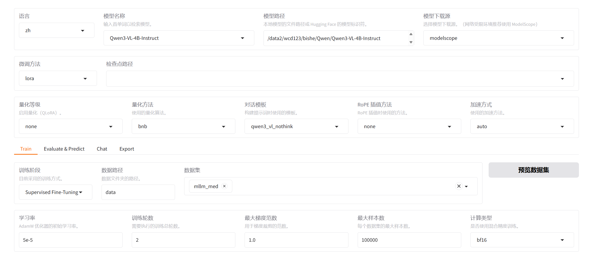

# bishe-sft
📌 Project Overview

This project optimizes the general multimodal large model for downstream OCR tasks, based on Qwen3-VL-4B. We adopt three core optimization schemes: LoRA fine-tuning, GRPO reinforcement learning and In-Context Learning (ICL).
This repository is my outstanding undergraduate graduation project. You can replace the dataset, base model and experimental methods based on this complete project framework to complete your own graduation design independently.

## Usage
```bash
git clone https://github.com/akjncjancj/bishe-sft.git
cd bishe-sft/sft-ocr
```
Then, Follow the sections Datasets and Base Models to download the corresponding datasets and models.


## Datasets
We use four public open-source OCR datasets for model evaluation. The download methods are shown below:
```bash
from datasets import load_dataset
ds = load_dataset("MiXaiLL76/CTW1500_OCR", cache_dir='./data/CTW') 
ds = load_dataset("MiXaiLL76/ICDAR2013_OCR", cache_dir='./data/ICDAR2013') 
ds = load_dataset("MiXaiLL76/ICDAR2015_OCR", cache_dir='./data/ICDAR2015') 
ds = load_dataset("Teklia/CASIA-HWDB2-line", cache_dir='./data/CASIA') 
```

## Model(baseline)
We take Qwen3-VL-4B as our primary baseline model. In addition, we also support gemma-3-4b and MiniCPM-V-2_6, Dataset download scripts can be found in `download.py`:
```bash
from modelscope import snapshot_download
# model_dir = snapshot_download('google/gemma-3-4b-it',cache_dir='./')
# model_dir = snapshot_download('OpenBMB/MiniCPM-V-2_6',cache_dir='./')
model_dir = snapshot_download('Qwen/Qwen3-VL-4B-Instruct',cache_dir="./")
```

## LLaMA-Factory
We utilize the `LLaMA-Factory` framework for the LoRA fine-tuning stage, and the relevant configurations are as follows:
```bash
# Clone the repository
git clone --depth 1 https://github.com/hiyouga/LLaMA-Factory.git

cd LLaMA-Factory

# Install dependencies
pip install -e ".[torch,metrics]"
```

After installation, run the following command. The installation is successful if the output matches the expected result.

```bash
llamafactory-cli version
```
Expected output: Welcome to LLaMA Factory, version 0.9.6.dev0         


## Repository Structure
After downloading the models, datasets and framework as described above, the overall project directory structure is shown below:
```
bishe-sft/
├── sft-ocr/                  
   ├── LLaMA-Factory             
   ├── .py                     
   ├── Qwen/
   │   ├── Qwen3-VL-4B-Instruct            
   └── data/          
       ├── CTW
       ├── ICDAR2013
       ├── ICDAR2015
       └── CASIA
```
---


## Stage 1: LoRA Fine-tuning
### Step 1: Dataset Preparation

We first select 3000 samples from the CTW dataset and 4000 samples from the CASIA dataset, convert them to the required format, and then move the processed files to the correct directory:
```bash
#run
python llama-data-merge.py

#move it
mv OCR_data_7000 LLaMA-Factory/data
```
then, Modify `dataset_info.json` under the `LLaMA-Factory/data` directory and add your custom dataset entry at the end of the file:
```
"mllm_med": {

    "file_name": "OCR_data_7000/OCR_data_7000.json",
    "formatting": "sharegpt",
    "columns": {

      "messages": "messages",
      "images": "images"
    },
    "tags": {

      "role_tag": "role",
      "content_tag": "content",
      "user_tag": "user",
      "assistant_tag": "assistant"
    }
  }
```

### Step 2: Run
Run the command below to launch the fine-tuning UI shown in the figure. Select the corresponding model and parameters, then click `run` to start LoRA fine-tuning:
```bash
#run
llamafactory-cli webui
```


You may encounter some minor errors when running the UI interface, which can be resolved easily by referring to solutions from AI tools or CSDN. Meanwhile, we provide a set of effective hyperparameters for LoRA fine-tuning:
| Parameter Name       | Value        |
|----------------------|--------------|
| Learning Rate       | 5e-5         |
| Max Gradient Norm   | 1.0          |
| Hardware Setup      | 8*RTX 3090   |
| Cutoff Length       | 2048         |
| Batch Size          | 4            |
| Gradient Accumulation Steps | 8 |
| Validation Split Ratio | 0.2      |
| Learning Rate Scheduler | cosine  |
| Warmup Steps        | 10           |
| LoRA Rank           | 4            |
| LoRA Alpha          | 8            |
| Dropout             | 0.1          |
| Epochs              | 2            |

After LoRA fine-tuning completes, the corresponding LoRA weights will be generated. Use the `Export` function in the UI to merge these weights into the base model. We name the merged model `lora-qkvo-mode`l and store it under the `Qwen` folder.

## Stage 2: GRPO Fine-tuning
After finishing the LoRA fine-tuning in Stage 1, we run the following command to perform GRPO reinforcement learning alignment for further improvement of the model's generalization and format compliance.
```bash
python finetune-GRPO-merge.py
```
> **note**: This code was executed on a single A800 GPU via AutoDL.


## Stage 3: ICL

### • Run the baseline multimodal large model
```bash
#Run Qwen3-VL for inference
python data-inference.py

#Run gemma-3 for inference
python infer-gemma.py

#Run MiniCPM-V for inference
python infer-minicpm.py

```
> **note**: You can freely switch datasets by simply modifying this line of code: ` ds = load_dataset("./data/CASIA", cache_dir="./cache")` 

### • Run the code after LoRA fine-tuning
Simply replace the model path `Qwen/Qwen3-VL-4B-Instruct` in `data-inference.py` with `Qwen/lora-qkvo-model`, then run the script:
```bash
python data-inference.py
```

### • Run the model trained with GRPO
```bash
python data-inference-finetune.py
```

### • Run the final model enhanced with ICL
```bash
python ICL-3yz.py
```
> **note**: You can adjust the number of ICL examples in the line `icl_examples = [train_data[i] for i in range(5)]` to investigate the impact of different values on accuracy.


